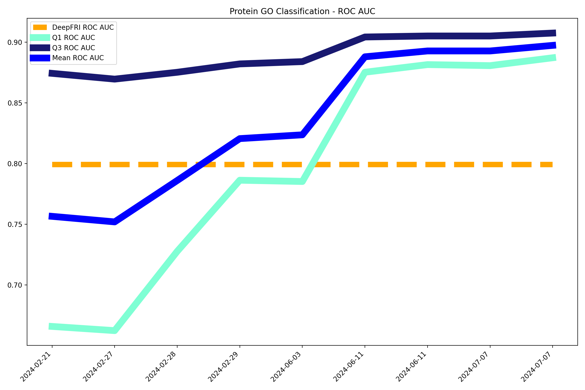
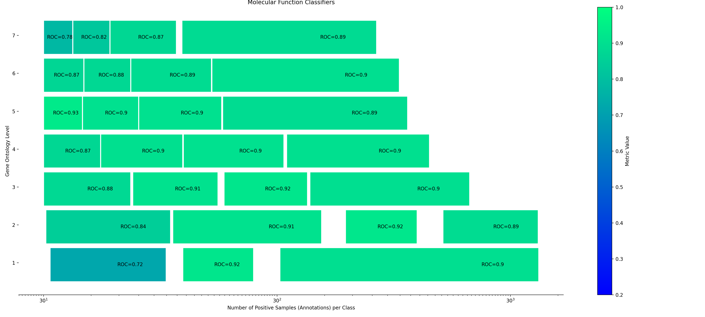

# Pitágoras PhD experiments

## Protein Molecular Function Classification

Using deep learning to predict the molecular functions of amino acid sequences. 

The model takes amino acid sequences (FASTA) and taxon (NCBI Taxon ID) as input and predicts 1688 molecular functions from Gene Ontology.

### Features
- Usage of Facebook's ESM models for feature extraction;
- Taxon ID for finding closest common ancestors;
- Hierarchical classification with 4 classification nodes for each MF layer;
    - Separating the classification task between several small models (instead of a very large one) allows the project to cover a very large number of different molecular functions;
- Optimization using parameter search metaheuristic;
- Post-processing using characteristics of the hierarchical relationships between GO terms;

### Project progress

The following graph shows the score for classification quality since the start of the project:



Comparison with other software:

- DeepFRI: [github.com/flatironinstitute/DeepFRI](https://github.com/flatironinstitute/DeepFRI) 

Current state of the classification nodes:


### Instalation

```
$ conda env create -f environment.yml
$ conda activate phd
```

### Prepare data for training

```
$ snakemake download_esm --cores 1
$ snakemake sep_validation --cores 1
```

The sep_validation task will call the tasks download_go, download_goa, download_uniprot, annotated_protein_list, create_features, create_taxon_profiles and list_labels

### Run a training experiment

```
$ python experiment.py test default "A test on a small part of the GO MF network without optimal parameter search"
$ python experiment.py test optimize "A test on a small part of the GO MF network with optimal parameter search"
$ python experiment.py test optimize "Train on all of the GO MF network with optimal parameter search"
```